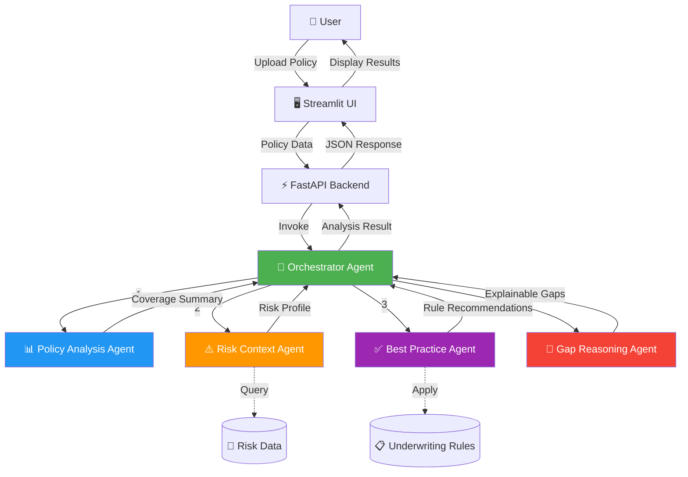

# Coverage Gap Detection POC

AI-powered P&C insurance coverage gap detection system using multi-agent architecture.

## 🎯 Overview

This POC demonstrates how **Agentic AI** can analyze existing P&C insurance policies, detect coverage gaps, explain their significance, and recommend missing coverages through an intuitive web interface.

### Business Value

- **Increased Revenue**: Cross-sell opportunities through gap identification
- **Risk Mitigation**: Reduce underinsurance and claim disputes
- **Customer Trust**: Transparent, explainable AI recommendations
- **Productivity**: Automate policy reviews for agents and underwriters

## 🏗️ Architecture

The system uses a **multi-agent design** coordinated by an orchestrator:



### Agent Responsibilities

1. **Policy Analysis Agent** 📊
   - Extracts existing coverages (auto, home, umbrella, etc.)
   - Summarizes limits and deductibles
   - Provides customer profile overview

2. **Risk Context Agent** ⚠️
   - Evaluates location-based risks (flood zones, earthquakes, crime)
   - Assesses asset exposure (net worth, property values)
   - Identifies lifestyle risk factors (watercraft, rental properties)

3. **Best Practice Agent** ✅
   - Applies codified underwriting rules
   - Checks coverage-to-value ratios
   - Validates liability limits against best practices

4. **Gap Reasoning Agent** 💬
   - Synthesizes findings from all agents
   - Generates plain-English explanations
   - Assigns risk severity (High/Medium/Low)
   - Estimates premium impact

5. **Orchestrator** 🎯
   - Coordinates agent workflow using LangGraph
   - Manages state transitions
   - Aggregates results into final analysis

## 🚀 Quick Start

### Prerequisites

- Python 3.9+
- Groq API key (free tier available at [groq.com](https://groq.com))

### Installation

1. **Clone and navigate to the project:**
```bash
cd /Users/snehallale/.gemini/antigravity/scratch/coverage-gap-detection-poc
```

2. **Create and activate virtual environment:**
```bash
python -m venv venv
source venv/bin/activate  # On Windows: venv\Scripts\activate
```

3. **Install dependencies:**
```bash
pip install -r requirements.txt
```

4. **Set up environment variables:**
The `.env` file is already configured with your Groq API key.

### Running the Application

**Terminal 1 - Start the FastAPI backend:**
```bash
python main.py
```
The API will be available at `http://localhost:8000`
- API Documentation: `http://localhost:8000/docs`

**Terminal 2 - Start the Streamlit UI:**
```bash
streamlit run ui/streamlit_app.py
```
The UI will open automatically at `http://localhost:8501`

## 📖 Usage

1. **Upload Policy Data**
   - Upload a JSON file with policy information
   - OR select one of the sample policies from the sidebar

2. **Analyze Coverage**
   - Click "🔍 Analyze Coverage" button
   - AI agents process the policy (takes ~10-20 seconds)

3. **Review Results**
   - View identified coverage gaps
   - See risk severity badges (High/Medium/Low)
   - Read plain-English explanations
   - Review premium impact estimates

### Sample Policies

Three sample policies are included in `app/data/sample_policies/`:

- **high_networth_miami.json**: High net worth customer in flood zone (missing umbrella + flood)
- **san_francisco_home.json**: SF homeowner (missing earthquake coverage)
- **well_covered_chicago.json**: Baseline policy with good coverage

### Policy JSON Format

```json
{
  "policy_number": "HO-2024-001234",
  "customer_profile": {
    "name": "Sarah Johnson",
    "zip_code": "33139",
    "net_worth": 2500000,
    "home_value": 850000,
    "additional_properties": 1,
    "has_watercraft": false,
    "has_high_value_items": true
  },
  "existing_coverages": [
    {
      "coverage_type": "home",
      "limit": 700000,
      "deductible": 2500,
      "premium": 2400
    }
  ]
}
```

## 🧪 Testing

Run the included tests:
```bash
pytest tests/
```

## 🔧 Technology Stack

- **Backend**: FastAPI (async API framework)
- **Agent Framework**: LangGraph (state-based workflow orchestration)
- **LLM**: Groq API with Llama 3.3 70B
- **UI**: Streamlit (rapid prototyping)
- **Data Models**: Pydantic (type validation)
- **Mock Data**: Synthetic risk and underwriting data

## 📊 Example Output

```
Policy: HO-2024-001234
Customer: Sarah Johnson
Gaps Found: 2

Gap 1: Missing Umbrella Liability Protection
Severity: High
Explanation: Your current liability coverage may not adequately protect 
your assets. Net worth of $2,500,000 requires additional liability 
protection. Without umbrella coverage, you could be personally liable 
for damages exceeding your policy limits.
Recommendation: We recommend adding umbrella coverage with a $2,500,000 
limit. Estimated annual premium: $500.00.

Gap 2: Flood Insurance Coverage Gap
Severity: High
Explanation: Standard homeowner policies don't cover flood damage. 
Property located in FEMA flood zone AE (Miami, FL). Flood insurance 
is essential to protect your property investment.
Recommendation: We recommend adding flood coverage with a $250,000 
limit. Estimated annual premium: $2,500.00.

Total Premium Impact: $3,000.00/year
```

## 🎨 Key Features

✅ **Explainable AI**: Clear, business-friendly explanations  
✅ **Multi-Agent System**: Specialized agents for focused analysis  
✅ **Risk-Based Prioritization**: High/Medium/Low severity ratings  
✅ **Premium Estimates**: Realistic cost projections  
✅ **Professional UI**: Business-ready interface  
✅ **Sample Data**: Pre-loaded scenarios for demos  

## 🔮 Production Scaling Considerations

### Data Integration
- Connect to policy management systems (APIs or database)
- Integrate real FEMA flood data, USGS earthquake data
- Pull customer net worth from financial systems

### LLM Enhancements
- Fine-tune models on insurance domain data
- Implement retrieval-augmented generation (RAG) for underwriting guidelines
- Add confidence scores to recommendations

### Agent Improvements
- Add more specialized agents (commercial, life insurance, etc.)
- Implement feedback loops for continuous learning
- Create agent evaluation metrics

### Infrastructure
- Deploy on cloud (AWS/GCP/Azure)
- Add caching for risk data lookups
- Implement async processing for batch analysis
- Add monitoring and observability (logs, metrics, traces)

### Compliance & Security
- Audit logging for all recommendations
- PII encryption and data governance
- Model versioning and rollback capabilities
- A/B testing framework for new agents

### Business Intelligence
- Analytics dashboard for gap detection trends
- ROI tracking (gaps identified → policies sold)
- Agent performance metrics
- Customer segmentation analysis

## 📁 Project Structure

```
coverage-gap-detection-poc/
├── app/
│   ├── agents/           # Multi-agent system
│   │   ├── orchestrator.py
│   │   ├── policy_analyzer.py
│   │   ├── risk_context.py
│   │   ├── best_practice.py
│   │   └── gap_reasoning.py
│   ├── api/             # FastAPI routes
│   ├── core/            # Config & models
│   ├── data/            # Mock data & samples
│   │   ├── mock_risk_data.py
│   │   ├── underwriting_rules.py
│   │   └── sample_policies/
│   └── utils/           # Utilities
├── ui/                  # Streamlit interface
├── tests/               # Test suite
├── docs/                # Documentation
├── main.py             # FastAPI entry point
├── requirements.txt
└── README.md
```

## 🤝 Contributing

This is a POC project. For production use, consider:
- Comprehensive test coverage
- Security audit
- Performance optimization
- Regulatory compliance review

## 📝 License

MIT License - free for educational and commercial use.

---

**Built with ❤️ using Agentic AI**

For questions or demo requests, contact the development team.
