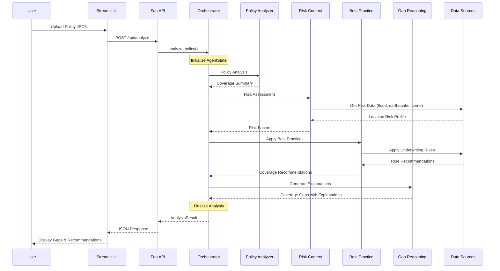
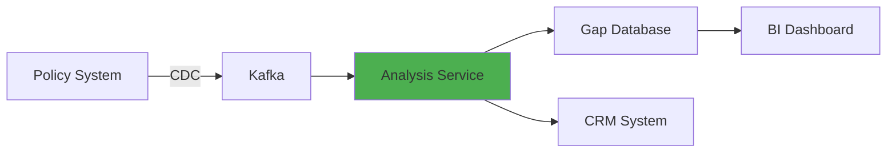

# Architecture Documentation

## System Overview

The Coverage Gap Detection POC uses a multi-agent architecture to analyze insurance policies and identify coverage gaps. The system is built on three main layers:

1. **Presentation Layer**: Streamlit web interface
2. **API Layer**: FastAPI backend
3. **Agent Layer**: LangGraph-orchestrated multi-agent system

## Multi-Agent Workflow



## Agent State Management

The `AgentState` object flows through the workflow, accumulating data at each stage:

```python
AgentState:
  policy_input: PolicyInput
  
  # Agent outputs
  policy_summary: str
  existing_coverages_summary: Dict
  risk_profile: Dict
  risk_factors: List[str]
  underwriting_recommendations: List[Dict]
  coverage_gaps: List[CoverageGap]
  
  # Final result
  analysis_result: AnalysisResult
```

## Data Flow

### Input
```json
{
  "policy_number": "HO-2024-001234",
  "customer_profile": {...},
  "existing_coverages": [...]
}
```

### Processing
1. **Policy Analysis** → Extract coverages and customer info
2. **Risk Assessment** → Identify location and asset risks
3. **Best Practices** → Apply underwriting rules
4. **Gap Reasoning** → Generate explanations

### Output
```json
{
  "policy_number": "HO-2024-001234",
  "customer_name": "Sarah Johnson",
  "total_gaps_found": 2,
  "coverage_gaps": [
    {
      "gap_type": "umbrella",
      "severity": "High",
      "title": "Missing Umbrella Liability Protection",
      "explanation": "...",
      "recommendation": "...",
      "estimated_annual_premium": 500.00,
      "risk_factors": ["High net worth", "Asset protection needed"]
    }
  ],
  "total_estimated_premium_impact": 3000.00,
  "analysis_summary": "..."
}
```

## Technology Choices

### LangGraph
- **Why**: Provides state management and workflow orchestration
- **Benefits**: Clear agent transitions, debuggable workflows, extensible
- **Alternative**: CrewAI (more opinionated, less control)

### Groq API
- **Why**: Fast inference, free tier for POC
- **Model**: Llama 3.3 70B (latest, best reasoning)
- **Production**: Consider OpenAI GPT-4 or fine-tuned models

### FastAPI
- **Why**: Async support, automatic OpenAPI docs, Pydantic integration
- **Benefits**: Production-ready, high performance, developer-friendly

### Streamlit
- **Why**: Rapid prototyping, Python-native, business-friendly
- **Production**: Consider React/Next.js for full customization

## Scalability Patterns

### Horizontal Scaling
- Deploy multiple FastAPI instances behind load balancer
- Cache risk data lookups (Redis)
- Async agent execution for batch processing

### Vertical Optimization
- Fine-tune LLM for insurance domain
- Reduce API calls with intelligent caching
- Optimize prompt templates

### Data Pipeline


## Security Considerations

1. **API Authentication**: Add JWT tokens for production
2. **Data Encryption**: Encrypt PII in transit and at rest
3. **Audit Logging**: Track all gap recommendations
4. **Rate Limiting**: Prevent API abuse
5. **Model Security**: Validate LLM outputs, prevent prompt injection

## Monitoring & Observability

### Metrics to Track
- Agent execution time per stage
- LLM token usage and costs
- Gap detection accuracy
- API response times
- Error rates

### Logging Strategy
- Structured logging (JSON format)
- Trace IDs for request correlation
- Agent decision logging for explainability
- Performance profiling

---

For implementation details, see the source code in `app/agents/`.
